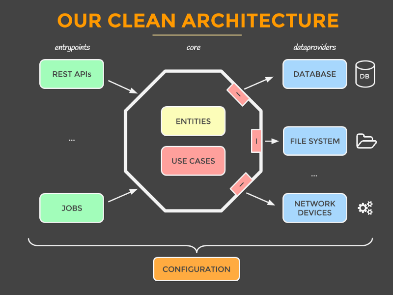

# 🧱 Arquitectura del Proyecto

La arquitectura del proyecto **Almuerza Perú** combina dos enfoques robustos: **Clean Architecture** para la lógica de negocio y **Component-Based Architecture** para la interfaz de usuario. Además, implementa **modularización con lazy loading** para mejorar el rendimiento.

---

## 📚 Tabla de Contenido

- [🔹 Clean Architecture](#-clean-architecture)
- [🔹 Component-Based Architecture (Angular)](#-component-based-architecture-angular)
- [🔹 Modularización + Lazy Loading](#-modularización--lazy-loading)

&nbsp;

## 🔹 Clean Architecture

<p align="center">
  
</p>

Este patrón separa la aplicación en capas con responsabilidades bien definidas:

- **Entidades (Modelo)**: Reglas de negocio puras y estructuras de datos.
- **Casos de Uso**: Lógica de aplicación que coordina entidades y reglas.
- **Interfaces**: Adaptadores entre la lógica y sistemas externos (UI, APIs, BD).
- **Infraestructura**: Detalles concretos como frameworks, librerías y drivers.

➡️ **Las capas internas nunca dependen de las externas.**

### ✅ Beneficios

- Bajo acoplamiento, alta cohesión.
- Independencia de frameworks.
- Fácil de testear, mantener y escalar.
- Permite cambiar UI o DB sin afectar lógica central.
- Ideal para proyectos que deben crecer a largo plazo.

&nbsp;

## 🔹 Component-Based Architecture (Angular)

<p align="center">
  
</p>

La UI se construye con componentes reutilizables, encapsulados en módulos:

- Cada **componente** gestiona su HTML, lógica y estilos.
- Los **módulos** agrupan componentes relacionados por dominio.
- Favorece la escalabilidad y reutilización del código.

**Ejemplo de organización:**

- `LoginFormComponent` → `AuthModule`
- `RestaurantCardComponent` → `RestaurantsModule`
- `DailyMenuListComponent` → `MenusModule`

### ✅ Beneficios

- Alta reutilización de código.
- Separación de responsabilidades visuales.
- Facilita pruebas unitarias de UI.
- Compatible con principios de diseño atómico (Atomic Design).
- Aumenta mantenibilidad y flexibilidad para nuevos features.

&nbsp;

## 🔹 Modularización + Lazy Loading

<p align="center">
  
</p>

Cada módulo funcional se carga **dinámicamente** solo cuando se necesita, usando rutas como esta:

```ts
const routes: Routes = [
  {
    path: 'auth',
    loadChildren: () => import('./features/auth/auth.module').then((m) => m.AuthModule)
  },
  {
    path: 'menus',
    loadChildren: () => import('./features/menus/menu.module').then((m) => m.MenuModule)
  }
];
```

Esto optimiza el rendimiento inicial de la aplicación, especialmente en móviles.

### ✅ Beneficios

- Mejora el tiempo de carga inicial.
- Evita cargar código innecesario.
- Permite escalar sin afectar el performance.
- Facilita segmentar funcionalidades por roles o flujos.
- Mejora la mantenibilidad del código.

&nbsp;

## 🏗️ Implementación en Angular 18

El proyecto **Almuerza Perú** utiliza las características más modernas de Angular 18:

### ⚡ Standalone Components

- **Configuración moderna**: Todos los componentes son standalone, eliminando la necesidad de módulos tradicionales
- **ApplicationConfig**: Uso de configuración basada en providers en lugar de módulos
- **Tree Shaking mejorado**: Mejor optimización de bundles por eliminación de código innecesario

### 🚀 Routing Moderno

- **loadComponent**: Para componentes individuales standalone
- **loadChildren**: Para módulos de features con lazy loading
- **Optimización automática**: Mejor performance con carga diferida

### 🔧 Server-Side Rendering (SSR)

- **Angular Universal**: Configurado con `@angular/ssr` 18.2.20
- **Express Server**: Servidor Node.js para SSR completo
- **Hydration**: Cliente-servidor sincronizado sin errores
- **PWA Ready**: Progressive Web App con manifest configurado

### 🧪 Testing Moderno

- **Jest**: Framework de testing 29.7.0 con configuración Angular
- **Playwright**: Testing E2E 1.54.1 para pruebas end-to-end
- **19 test suites, 84 tests**: Todos pasando correctamente

### 📊 Resultados de Performance

- **Bundle inicial**: 218.49 kB optimizado
- **Zone.js**: 90.20 kB incluido correctamente
- **Build exitoso**: Tanto desarrollo como producción
- **Servidores disponibles**:
  - Desarrollo: `http://localhost:4200`
  - SSR Producción: `http://localhost:4000`

## Conclusión

Gracias a esta arquitectura, la aplicación es:

- 🧩 Modular
- 🚀 Rápida
- 🔧 Fácil de mantener
- 📦 Escalable a nuevas funcionalidades
- ✅ Sólida para equipos grandes o colaboraciones a largo plazo
- ⚡ **Angular 18 nativo**: Usando las últimas características del framework

## &nbsp;

© Almuerza Perú – 2025
