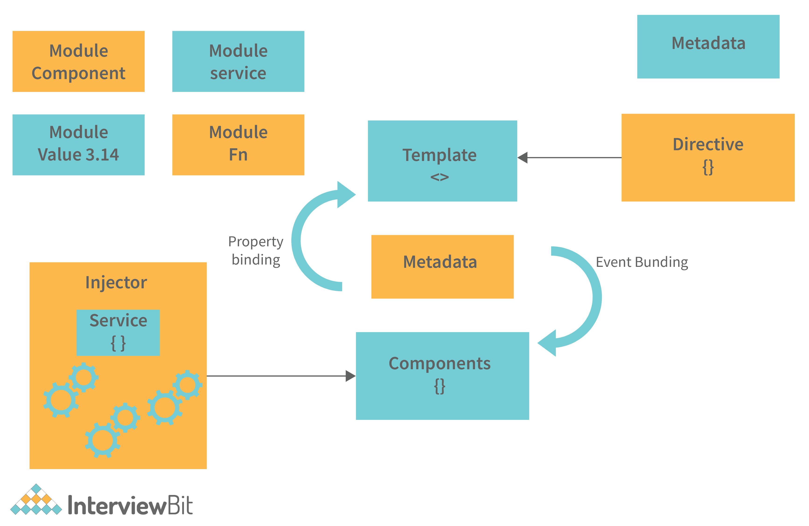

# 🧱 Arquitectura del Proyecto

La arquitectura de **Almuerza Perú** combina **Clean Architecture** para la lógica de negocio, **Component-Based Architecture** para la UI y una fuerte modularización con **Lazy Loading** y SSR. Todo está alineado con las mejores prácticas de Angular 18 y el desarrollo moderno.

 

## 📚 Tabla de Contenido

- [🔹 Clean Architecture](#-clean-architecture)
- [🔹 Component-Based Architecture (Angular)](#-component-based-architecture-angular)
- [🔹 Modularización + Lazy Loading](#-modularización--lazy-loading)
- [🏗️ Implementación Angular 18 y SSR](#-implementación-en-angular-18)

 

## 🔹 Clean Architecture

<p align="center">
  
</p>

**Clean Architecture** separa la aplicación en capas independientes:

- **Entidades (Modelo)**: Reglas de negocio y estructuras de datos puras.
- **Casos de Uso**: Lógica de aplicación que orquesta entidades y reglas.
- **Interfaces**: Adaptadores entre lógica y sistemas externos (UI, APIs, BD).
- **Infraestructura**: Frameworks, librerías y detalles técnicos.

➡️ **Las capas internas nunca dependen de las externas.**

**Ventajas:**

- Bajo acoplamiento, alta cohesión.
- Independencia de frameworks.
- Fácil de testear, mantener y escalar.
- Permite cambiar UI o DB sin afectar la lógica central.

&nbsp;

## 🔹 Component-Based Architecture (Angular)

<p align="center">
  
</p>

La UI se construye con componentes standalone reutilizables, agrupados en módulos funcionales:

- Cada **componente** gestiona su HTML, lógica y estilos.
- Los **módulos** agrupan componentes por dominio de negocio.
- Favorece la escalabilidad y reutilización del código.

**Ejemplo:**

- `LoginFormComponent` → `AuthModule`
- `RestaurantCardComponent` → `RestaurantsModule`
- `DailyMenuListComponent` → `MenusModule`

**Ventajas:**

- Alta reutilización de código.
- Separación de responsabilidades visuales.
- Facilita pruebas unitarias de UI.
- Compatible con Atomic Design.
- Mantenibilidad y flexibilidad para nuevos features.

&nbsp;

## 🔹 Modularización + Lazy Loading

<p align="center">
  
</p>

Cada módulo funcional se carga **dinámicamente** solo cuando se necesita, usando rutas como:

```ts
const routes: Routes = [
  {
    path: 'auth',
    loadChildren: () => import('./features/auth/auth.module').then((m) => m.AuthModule)
  },
  {
    path: 'menus',
    loadChildren: () => import('./features/menus/menu.module').then((m) => m.MenuModule)
  }
];
```

**Ventajas:**

- Mejora el tiempo de carga inicial.
- Evita cargar código innecesario.
- Permite escalar sin afectar el performance.
- Facilita segmentar funcionalidades por roles o flujos.
- Mejora la mantenibilidad del código.

&nbsp;

## 🏗️ Implementación en Angular 18 y SSR

El proyecto utiliza las características más modernas de Angular 18:

### ⚡ Standalone Components

- Todos los componentes son standalone, sin módulos tradicionales.
- Uso de `ApplicationConfig` y providers modernos.
- Tree Shaking mejorado y bundles optimizados.

### 🚀 Routing Moderno

- `loadComponent` para componentes individuales.
- `loadChildren` para módulos funcionales con lazy loading.
- Optimización automática de rutas y carga diferida.

### 🔧 Server-Side Rendering (SSR)

- Angular Universal con `@angular/ssr` 18.2.20.
- Servidor Express para SSR completo.
- Hydration: sincronización cliente-servidor sin errores.
- PWA lista para producción.
- SSR deshabilitado en desarrollo para mejor DX, habilitado en producción para SEO y performance.

### 🧪 Testing Moderno

- Jest 29.7.0 para unit tests con preset Angular.
- Playwright 1.54.1 para pruebas E2E.
- 21 test suites, 146 tests, cobertura 99.64%.

### 📊 Performance

- Bundle inicial: 232.69 kB optimizado.
- Zone.js: 90.20 kB incluido correctamente.
- Build exitoso en desarrollo y producción.
- Servidores disponibles:
  - Desarrollo: `http://localhost:4200`
  - SSR Producción: `http://localhost:4000`

&nbsp;

## Conclusión

Gracias a esta arquitectura, la aplicación es:

- 🧩 Modular
- 🚀 Rápida
- 🔧 Fácil de mantener
- 📦 Escalable
- ✅ Sólida para equipos grandes
- ⚡ Angular 18 nativo y moderno

&nbsp;

---

© 2025 Almuerzos Perú
