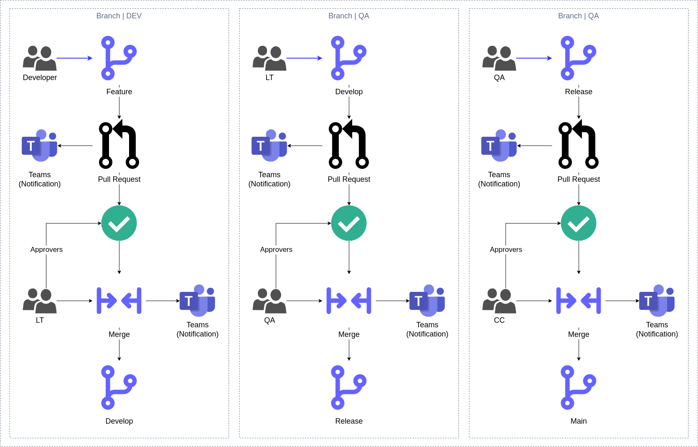
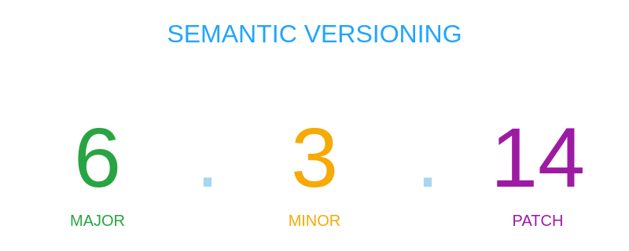

# 🚦 GitFlow, Branches, Tags, Commits y Changelog

Esta guía describe el flujo de trabajo Git, convenciones de ramas, tags, commits y el manejo del changelog para el proyecto **Almuerza Perú**.

## GitFlow



Se utiliza un flujo de trabajo basado en **GitFlow** para organizar el desarrollo y facilitar la trazabilidad de cambios.

## Tags



- **MAJOR**: Cambios incompatibles con versiones anteriores. Reinicia PATCH y MINOR a 0.
- **MINOR**: Nueva funcionalidad compatible. Reinicia PATCH a 0.
- **PATCH**: Correcciones de errores compatibles.

&nbsp;

## Pull Requests

Este repositorio utiliza **plantillas personalizadas** para Pull Requests (PRs). Por favor, selecciona la plantilla correspondiente según el tipo de cambio que estás realizando.

### ✨ Plantillas disponibles

- 🐛 Bugfix
- ✨ Feature
- 🚑 Hotfix

### 🧩 ¿Cómo usarlas?

1. Al abrir un nuevo Pull Request, selecciona el archivo markdown adecuado según el cambio (`bugfix`, `feature`, `hotfix`).
2. Copia su contenido.
3. Pega el contenido en el campo de descripción del PR.
4. Completa los campos antes de enviar el PR.

> 🔒 Esto asegura consistencia, claridad y facilidad para la revisión del equipo.

**Recomendación:** No más de 50 commits por cada pull request.

&nbsp;

## Changelog

El changelog debe mantenerse en el archivo `CHANGELOG.md` en la raíz del proyecto. Cada versión debe documentar los cambios principales siguiendo el estándar [Keep a Changelog](https://keepachangelog.com/es-ES/1.0.0/) y [SemVer](https://semver.org/lang/es/).

### Ejemplo de sección de changelog

```markdown
## [1.2.0] - 2025-07-27

### Added

- Nueva funcionalidad de login social
- Soporte para PWA offline

### Changed

- Actualización de dependencias Angular 18.2.13

### Fixed

- Corrección de bug en menú diario
```

&nbsp;

---

© 2025 Almuerzos Perú
