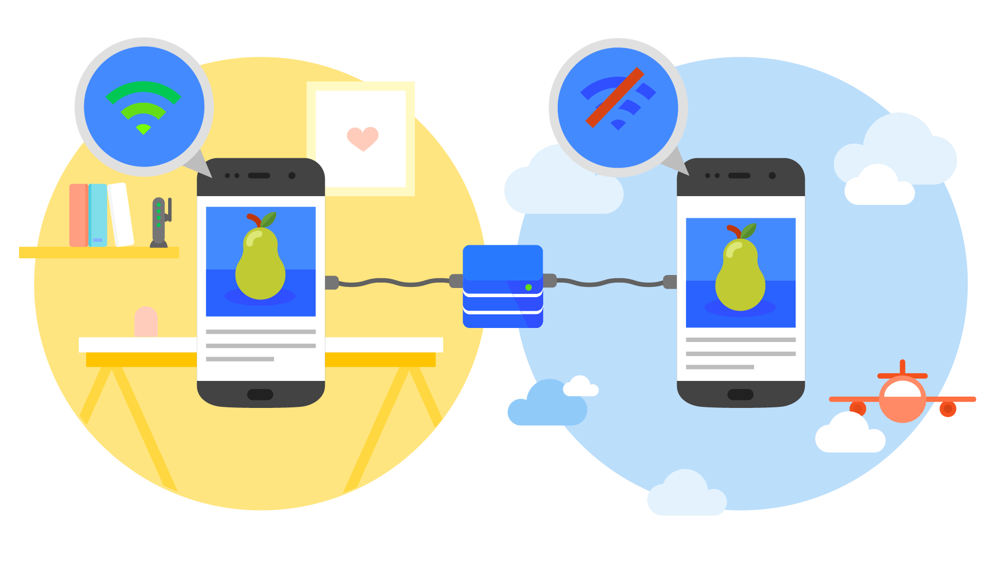

# 📱 Tipo de Aplicación

**Almuerza Perú** es una **Progressive Web App (PWA)** moderna, instalable y optimizada para dispositivos móviles y escritorio. Combina lo mejor de la web y las apps nativas para ofrecer una experiencia premium, rápida y accesible.

  

&nbsp;

## ✅ ¿Qué es una PWA?

Una PWA es una aplicación web avanzada que puede:

- Ser **instalada** como app nativa desde el navegador (Android/iOS/desktop).
- Funcionar **sin conexión** gracias a los **service workers**.
- Integrarse con el sistema operativo (pantalla completa, icono, splash, etc).
- Cargar rápidamente incluso con conexiones lentas o intermitentes.

&nbsp;

## 🚀 Ventajas para Almuerza Perú

- **Accesibilidad universal**: No requiere tienda de apps, funciona en cualquier navegador moderno.
- **Ligereza**: Ocupa poco espacio y se actualiza automáticamente.
- **Offline-ready**: El menú del día y recursos clave están disponibles sin conexión.
- **Actualizaciones automáticas**: Cada nueva versión se sincroniza al abrir la app.
- **Instalación inteligente**: Prompt automático y FAB para instalar, respetando preferencias del usuario.

&nbsp;

## 🔧 Tecnologías clave

| Tecnología                | Versión | Descripción                                               |
| ------------------------- | ------- | --------------------------------------------------------- |
| `@angular/service-worker` | 18.2.13 | Funcionalidades PWA y cacheo offline.                     |
| `@angular/pwa`            | -       | Esquema Angular CLI para configuración automática.        |
| `Service Worker`          | -       | Script que cachea archivos y maneja respuestas offline.   |
| `Manifest.json`           | -       | Define nombre, ícono, colores y comportamiento de la app. |

&nbsp;

---

© 2025 Almuerzos Perú
